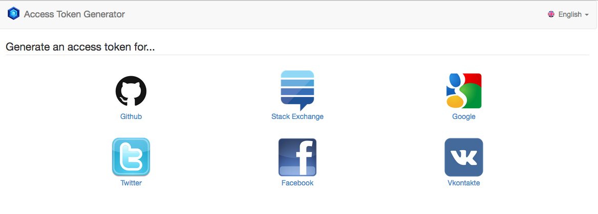
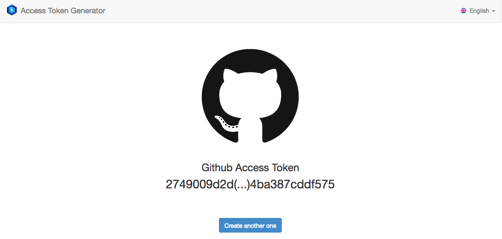

Access Token Generator
========================

Application built on top of [symfony-quickstart](https://github.com/ninsuo/symfony-quickstart)

## Installation

```sh
php -r "readfile('https://getcomposer.org/installer');" | php
php composer.phar install
php app/console doctrine:schema:create
```

## Usage

In order to get access tokens, you need to get your client ID and secret on enabled providers:

- GitHub Login: https://github.com/settings/developers
- StackExchange Login: https://stackapps.com/apps/oauth/
- Google Login: https://console.developers.google.com/project
- Twitter Login: https://apps.twitter.com/
- Facebook Login: https://developers.facebook.com/apps/





## License

- This project is released under the MIT license

- Fuz logo is © 2013-2017 Alain Tiemblo

- Default image used on social meta tags is CC0
